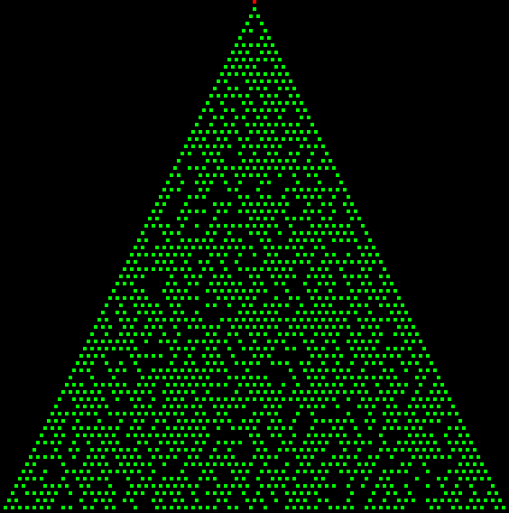

# Uiua Solutions

Advent of Code solutions written in [Uiua](https://www.uiua.org/) version 0.18.0-dev.3

## Running Solutions

| Command             | Description                        |
| ------------------- | ---------------------------------- |
| `make run`          | Run today's solution               |
| `make run day=01`   | Run solution for specified day     |
| `make test`         | Run tests                          |
| `make setup day=01` | Create template solution for a day |

## Animations

### Day 01 - Dial rotations

    

### Day 04 - Removing rolls of paper

    

### Day 07 - Moving through laboratories

  
  

### Day 10 - Lights turning on

    

